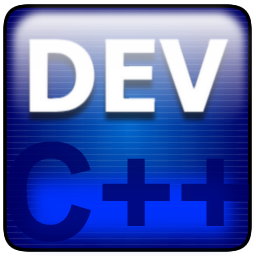

<html>
  <h1>Hi there 👋 I'm Lucas Felipe</h1>
  <h2>Welcome to my GitHub profile!</h2>
  <i>* Este arquivo também esta disponível em <a href="README.pt-br.md">Português do Brasil</a></i>    
  <ul>
    <li>:book: I’m currently studying <strong>System Analysis and Development</strong> at <strong>Faculdade de Tecnologia de Guaratinguetá</strong></li>
    <li>🌱 I’m currently learning <strong>Java</strong> and <strong>JavaScript</strong></li>
    <li>😄 <strong>Pronouns:</strong> he/him</li>
    <li>⚡ <strong>Fun fact:</strong> I have a technical degree at electrical-electronic engineering from <strong>Colégio Técnico Industrial de Guaratinguetá</strong></li>
  </ul>
  <h2>Tech Stack - Click to see related projects!</h2>
  

    <h3>Markup and Style Languages</h3>
    
    
    
    
  

  

    <h3>Programming Languages</h3>
    <!---->
    

    
    
    
  

  

    <h3>Softwares</h3>
    
    
    
    
  

  

    <h3>Others</h3>
    
    
    
    
  

  <h2>Social Media - Click to contact me!</h2>
  

    
    
    
    
  

    
  <figure>
    
  </figure>
  <figure>
    
  </figure>
</html>
